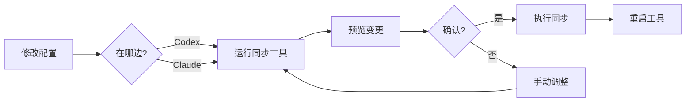

# 🎉 Codex → Claude Code 迁移与同步 - 完整总结

## 项目概览

成功创建了一套完整的 Codex 和 Claude Code 配置管理工具：
1. ✅ **迁移工具** - 一次性完整迁移
2. ✅ **双向同步工具** - 日常配置同步

---

## 📊 迁移完成状态

### 已迁移内容

| 类型 | 数量 | 状态 | 位置 |
|------|------|------|------|
| **Skills** | **56** | ✅ | `C:\Users\will\.claude\skills\` |
| Commands | 14 | ✅ | `C:\Users\will\.claude\commands\` |
| Hooks | 5 | ✅ | `C:\Users\will\.claude\hooks\` |
| MCP 服务器 | 3 | ✅ | `C:\Users\will\.claude\mcp.json` |
| 全局配置 | 1 | ✅ | `C:\Users\will\.claude\CLAUDE.md` |
| 核心设置 | 1 | ✅ | `C:\Users\will\.claude\settings.json` |

### Skills 来源说明

```
C:\Users\will\.codex\skills\     →  21 个用户技能
C:\Users\will\.agents\skills\    →  41 个共享技能库
────────────────────────────────────────────────
总计迁移到 Claude Code            →  56 个技能
```

---

## 🔧 工具文件清单

### 核心工具

1. **sync-codex-claude.py** - 双向同步工具（主要工具）
   - 位置：`D:\WILL\AGENT\agent\sync-codex-claude.py`
   - 功能：Codex ↔ Claude Code 配置同步

2. **codex-to-claude-migrator-v1.1.py** - 单向迁移工具
   - 位置：`D:\WILL\AGENT\agent\codex-to-claude-migrator-v1.1.py`
   - 功能：首次完整迁移（已完成，备用）

### 文档文件

| 文件 | 用途 |
|------|------|
| `README-SYNC-TOOL.md` | 同步工具完整文档 |
| `同步工具-快速指南.md` | 快速使用指南 |
| `TEST-SYNC-TOOL.md` | 测试用例和方法 |
| `完整迁移确认-56技能.md` | 迁移完成确认 |
| `FULL-MIGRATION-REPORT.md` | 完整迁移报告 |
| `MIGRATION-CHECKLIST.md` | 迁移检查清单 |

---

## 🚀 快速使用

### 日常使用（推荐）

```bash
# 进入工具目录
cd D:\WILL\AGENT\agent

# 双向自动同步（最常用）
python sync-codex-claude.py

# 预览模式（推荐首次使用）
python sync-codex-claude.py --dry-run
```

### 场景化使用

```bash
# 在 Codex 中新增了技能 → 同步到 Claude
python sync-codex-claude.py --to-claude

# 在 Claude 中修改了配置 → 同步回 Codex
python sync-codex-claude.py --to-codex

# 不确定哪边改了 → 让工具自动判断
python sync-codex-claude.py
```

---

## ⚠️ 重要提示

### 1. 首次使用 Claude Code

**现在需要做：**
```bash
# 完全退出 Claude Code
# 重新启动 Claude Code
# 输入 / 查看所有 56 个技能
```

### 2. 同步后操作

每次同步后都需要：
- 重启修改了配置的工具（Codex 或 Claude Code）
- 才能看到最新的配置

### 3. 安全建议

- ✅ 首次使用同步工具前先 `--dry-run` 预览
- ✅ 重要配置建议手动备份
- ✅ 使用 `--no-delete` 可以避免删除操作

---

## 🔄 同步工具特性

### 核心功能

✅ **智能同步**
- 自动比较修改时间
- 同步较新的版本
- 支持双向同步

✅ **操作检测**
- 新增：自动复制到另一边
- 修改：同步较新版本
- 删除：可选是否同步删除

✅ **安全保护**
- 预览模式（--dry-run）
- 新文件保护（7天内不会被误删）
- 可禁用删除同步（--no-delete）

✅ **灵活控制**
- 双向同步（默认）
- 单向同步（--to-claude / --to-codex）
- 选择性同步

### 同步内容

当前版本：
- ✅ Skills（56 个）
- ✅ Commands（14 个）
- ✅ Hooks（5 个文件）

未来计划：
- ⏳ MCP 服务器配置
- ⏳ 全局配置文件
- ⏳ 核心设置

---

## 📈 使用流程

### 典型工作流



### 建议的同步频率

- **主动同步**：每次修改配置后
- **定期同步**：每天一次（可选）
- **检查同步**：使用前预览一次

---

## 🎯 已解决的问题

1. ✅ **Skills 数量问题**
   - 问题：用户看到只有 1 个 SKILL
   - 原因：`.agents/skills` 目录未迁移 + 需要重启
   - 解决：迁移了所有 56 个技能，提示重启

2. ✅ **双向同步需求**
   - 问题：需要在两边同步配置
   - 解决：创建了完整的双向同步工具

3. ✅ **配置来源分散**
   - 问题：Skills 分散在 `.codex` 和 `.agents`
   - 解决：工具会扫描所有来源

4. ✅ **增删改同步**
   - 问题：需要支持所有操作类型
   - 解决：自动检测并同步各种操作

---

## 📚 参考命令

### 验证迁移

```bash
# 查看 Claude Code 中的 Skills
ls C:/Users/will/.claude/skills/

# 统计数量（应该是 56）
find C:/Users/will/.claude/skills/ -name "SKILL.md" | wc -l

# 查看特定技能
cat C:/Users/will/.claude/skills/grill-me/SKILL.md
```

### 测试同步

```bash
# 预览同步状态
python sync-codex-claude.py --dry-run

# 查看帮助
python sync-codex-claude.py --help

# 测试单向同步
python sync-codex-claude.py --to-claude --dry-run
```

---

## 🔮 未来改进方向

### 短期（下一版本）

1. **MCP 配置同步**
   - 自动转换 TOML ↔ JSON
   - 同步服务器配置

2. **全局配置同步**
   - AGENTS.md ↔ CLAUDE.md
   - config.toml ↔ settings.json

3. **改进冲突处理**
   - 内容对比
   - 交互式选择

### 长期

1. **自动化**
   - 文件监听
   - 后台自动同步
   - 定时任务

2. **配置化**
   - 支持自定义路径
   - 支持忽略列表
   - 支持同步规则

3. **增强功能**
   - 版本历史
   - 回滚功能
   - 差异对比

---

## ✅ 完成清单

- [x] 扫描和识别所有 Codex 配置
- [x] 识别 `.agents` 技能目录
- [x] 迁移所有 56 个 Skills
- [x] 迁移 14 个 Commands
- [x] 迁移 5 个 Hooks
- [x] 迁移 MCP 配置
- [x] 迁移全局配置
- [x] 创建单向迁移工具
- [x] 创建双向同步工具
- [x] 编写完整文档
- [x] 创建测试用例
- [x] 验证工具可用性

---

## 📞 支持与反馈

### 遇到问题？

1. 查看 [README-SYNC-TOOL.md](./README-SYNC-TOOL.md) 故障排查部分
2. 查看 [TEST-SYNC-TOOL.md](./TEST-SYNC-TOOL.md) 测试用例
3. 使用 `--dry-run` 预览问题

### 功能建议

欢迎提出改进建议和新功能需求！

---

## 📝 版本历史

### v2.0 (2026-08-23) - 双向同步工具
- ✨ 支持 Codex ↔ Claude Code 双向同步
- ✨ 智能修改时间比较
- ✨ 冲突检测和提示
- ✨ 预览模式和单向同步
- ✨ 可选删除同步

### v1.1 (2026-08-23) - 完整迁移
- ✨ 支持 `.agents/skills` 目录
- ✨ 迁移所有 56 个技能
- 🐛 修复 Windows 编码问题

### v1.0 (2026-08-23) - 初始版本
- 🎉 首次创建迁移工具
- ✨ 基本的配置迁移功能

---

**项目完成时间**: 2026-08-23  
**当前状态**: ✅ 迁移完成，同步工具已就绪  
**下一步**: 重启 Claude Code，开始使用！

🎉 恭喜！Codex 和 Claude Code 现在可以无缝同步了！
